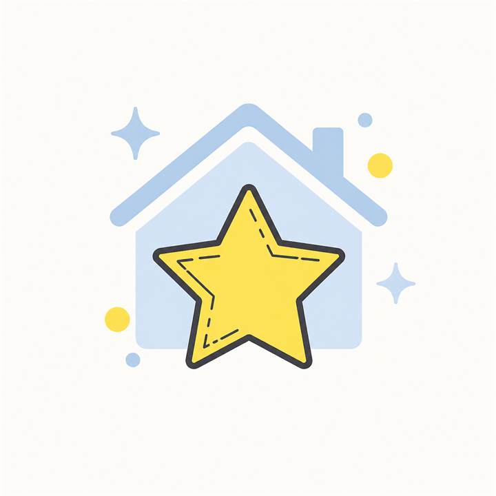
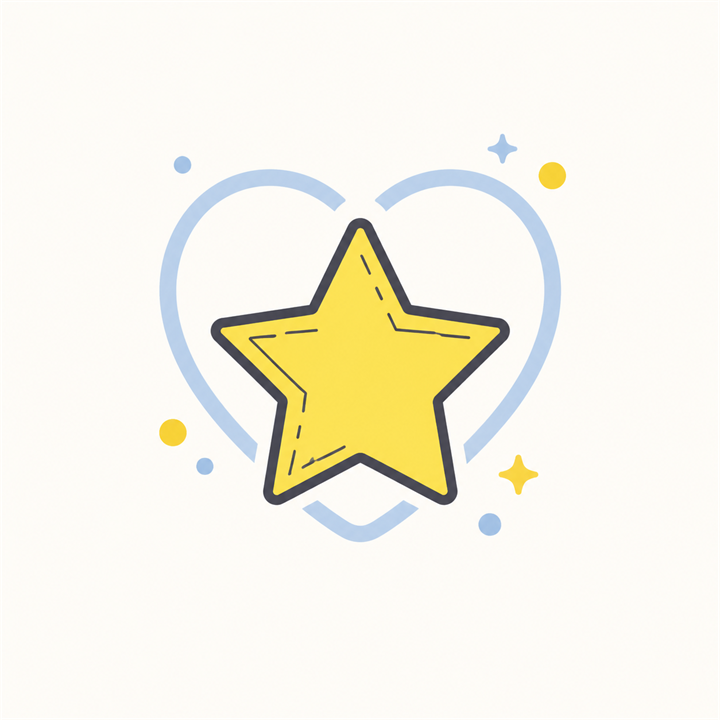

# Propostas de logótipo — Moniquinha Shine

As dez propostas usam a estrelinha atual como base e foram preparadas em PNG quadrado de 720 × 720 px. Cada ficheiro pode ser carregado diretamente no Perfil de Empresa Google.

| N.º | Proposta | Conceito | Pré-visualização |
| ---: | --- | --- | --- |
| 1 | Original refinado | Continuidade máxima com o ícone atual |  |
| 2 | Casa brilhante | Limpeza e cuidado da casa |  |
| 3 | Brilho mágico | Acabamento brilhante e energia |  |
| 4 | Bolha de sabão | Limpeza simples e reconhecível |  |
| 5 | Coração cuidadoso | Serviço próximo e cuidado pessoal |  |
| 6 | Janela limpa | Casa limpa e brilho visível |  |
| 7 | Escudo de confiança | Fiabilidade e proteção do lar |  |
| 8 | Órbita brilhante | Movimento e acabamento impecável |  |
| 9 | Varrimento suave | Ação de limpeza sem desenho literal de vassoura |  |
| 10 | Selo luminoso | Qualidade e resultado final |  |

## Especificações

- Formato: PNG
- Dimensões: 720 × 720 px
- Proporção: 1:1
- Margem de segurança para recorte circular
- Sem texto, para manter legibilidade em tamanhos pequenos
- Tamanho de cada ficheiro: inferior a 5 MB

O ficheiro `comparacao-10-propostas.png` serve apenas para seleção. Depois da escolha, o ficheiro numerado correspondente deve ser usado no Google.
